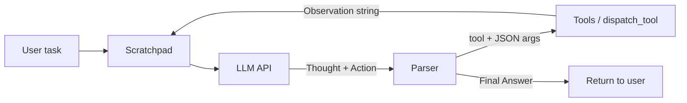

# Lab 3 — Combined Report (Group + Individual)

**Course:** VinUni AI Practical — Chatbot vs ReAct Agent  

| Field | Value |
| :--- | :--- |
| **Student** | Phung Huu Phu (2A202600283) |
| **Team** | Solo |
| **Report date** | 2026-04-06 |
| **Public repository URL** | `https://github.com/phusieupham100/vinuni-lab3-chatbot-react-agent` |


---

# Part A — Group Report

# Group Report: Lab 3 — Chatbot vs ReAct Agent (Production-Oriented Prototype)

- **Team Name**: 
- **Team Members**: Phung Huu Phu (2A202600283) | NOTE : SOLO
- **Deployment / report date**: 2026-04-06

---

## 1. Executive Summary

We built a **one-shot chatbot baseline** (`chatbot.py`) and a **ReAct agent** (`src/agent/agent.py`) that calls tools via **`src/tools/registry.py`**: **mock e-commerce** functions (`src/tools/ecommerce.py`) plus **bonus web tools** (`src/tools/web_tools.py`: `web_search`, `wikipedia_search`) for SCORING.md **Extra tools (+2)**. The loop is Thought → Action → Observation, with **structured JSON logs** under `logs/`.

- **Goal**: Show that multi-step checkout-style questions need **grounded tool use**, not only LLM parametric knowledge.

- **Success rate (demo task, measured on our runs)**  
  - **Pre-fix agent run** (`logs/2026-04-06.log`, first session): **0% success** — only `PARSE_ERROR` and `outcome: max_steps` (12 steps, no `TOOL_RESULT`), because the model emitted `**Action:**` while the parser expected `Action:`.  
  - **Post-fix run** (same log file, later session with parser + prompt updates): **100%** on the standard demo task — full `TOOL_RESULT` chain through `apply_vat`, then `AGENT_END` with `outcome: final_answer` (e.g. total **$1984.58** matching mock catalog).  
  - **Chatbot (`python chatbot.py --demo`)**: Always returns a `FINAL_ESTIMATE_USD:` line; correctness vs catalog varies (no tool access).

- **Key outcome**  
  On the instructor-style scenario (2× iPhone, coupon `WINNER`, Hanoi, 0.48 kg total, Vietnam VAT), the **agent** reproduces catalog-backed totals when tools execute; the **chatbot** only estimates. **Section 5** compares Agent **v1** vs **v2** on the same task using logged runs.

- **Group learning (flowchart / insight)**  
  - Grounding beats fluency: one-shot answers are not evidence of correct checkout math.  
  - Traces are the product: `PARSE_ERROR` vs `TOOL_RESULT` in `logs/` decided whether the agent was “real” or stuck.  
  - Iteration (v2) must be tied to a **logged failure mode**, not guesswork (see Sections 4–5).

---

## 2. System Architecture & Tooling

### 2.1 ReAct loop (implementation)

1. **User task** is the first block in the scratchpad (`Task: …`).
2. Each turn: `LLM.generate(scratchpad, system_prompt)` returns **Thought** + **Action** *or* **Final Answer** (parsed from model text).
3. If **Action**: `dispatch_tool(name, args)` runs Python functions; result string is appended as `Observation: …`.
4. Scratchpad grows: prior assistant text + observations; loop until **Final Answer** or `max_steps`.
5. **Telemetry**: `AGENT_START`, `LLM_STEP` (includes `usage`, `latency_ms`), `TOOL_RESULT`, `PARSE_ERROR`, `DUPLICATE_ACTION_BLOCKED` (v2), `AGENT_END` (includes `agent_version`, cumulative parse/tool/duplicate metrics where implemented).

**Conceptual diagram**



### 2.2 Tool definitions (inventory)

| Tool Name | Input (JSON keys) | Use case |
| :--- | :--- | :--- |
| `check_stock` | `item_name` (string) | Unit price USD + stock for catalog items (e.g. iphone, airpods). |
| `get_discount` | `coupon_code` (string) | Valid coupon → `discount_percent`; invalid → 0. |
| `calc_line_total` | `unit_price_usd`, `quantity`, `discount_percent` | Line total after % discount (before shipping/VAT). |
| `calc_shipping` | `weight_kg`, `destination_city` | Shipping USD from weight + city. |
| `apply_vat` | `amount_usd`, `country_code` (ISO2, e.g. `VN`) | VAT on given amount (demo: line + shipping for tax-inclusive total). |
| `web_search` | `query`, optional `max_results` (1–10) | DuckDuckGo text search (fallback: DDG instant answer JSON). **Requires network.** |
| `wikipedia_search` | `query` | Wikipedia `opensearch` API with proper `User-Agent` (**requires network**). |

### 2.2.1 Tool design evolution (rubric: progression of specs)

| Stage | What changed | Why |
| :--- | :--- | :--- |
| Initial mock | Five tools with JSON args and `dispatch_tool` routing | Enough surface for multi-step checkout. |
| Revision (lab) | `apply_vat` description clarified: **amount = line total + shipping** when the user asks for tax-inclusive total | Reduces wrong `amount_usd` (VAT on line only vs line+ship) and supports clearer few-shot text in Agent v2. |
| Agent v2 prompt | Few-shot order: stock → coupon → line → ship → VAT | Matches tool dependencies and reduces skipped steps. |
| **Bonus: web tools** | Added `web_search` + `wikipedia_search` in `web_tools.py`, routed through `registry.dispatch_tool` | Meets rubric “browsing / search” style tools; live HTTP + Wikipedia (no API keys). |

**Smoke test (run once with network):**

```bash
python -c "from src.tools.registry import dispatch_tool; print(dispatch_tool('wikipedia_search', {'query': 'Python'})[:200])"
```

### 2.3 LLM providers

- **Primary (typical)**: OpenAI — `gpt-4o` via `DEFAULT_MODEL` in `.env` (`OpenAIProvider`).
- **Secondary / comparison**: Google Gemini — `gemini-1.5-flash` via `GEMINI_MODEL` (`GeminiProvider`).
- **Optional**: Local GGUF via `llama-cpp` (`LocalProvider`) if built; not required for API-based runs.

**Benchmark command (latency + tokens from each `generate()`):**

```bash
python compare_providers.py --demo --providers openai,google --version v2
python compare_providers.py --demo --both-versions
```

---

## 3. Telemetry & Performance Dashboard

*Numbers below are taken from **`logs/2026-04-06.log`** (same demo task, `gpt-4o` unless noted). Per-step latency is **not** TTFT; it is full `generate()` time for that step (EVALUATION.md: loop latency).*

### 3.1 Post-fix successful agent run (representative “good” trace)

Source: log lines ~27–39 — `TOOL_RESULT` events through `apply_vat`, then `Final Answer` with **$1984.58**.

| Metric | Value |
| :--- | :--- |
| Steps (`LLM_STEP` count) | 6 |
| Sum of `latency_ms` across steps | **6248 ms** |
| Sum `prompt_tokens` | **4645** |
| Sum `completion_tokens` | **248** |
| Total tokens (prompt + completion) | **4893** |
| `PARSE_ERROR` events | **0** |
| `TOOL_RESULT` / tool calls | **5** |
| Termination | `AGENT_END` → `outcome: final_answer` |

### 3.2 Failed run (pre-fix — documents “bad” trace quality)

Source: log lines 1–26 — parser could not read `**Action:**`.

| Metric | Value |
| :--- | :--- |
| Steps | 12 |
| Sum of `latency_ms` | **15,339 ms** |
| `PARSE_ERROR` count | **12** (every step) |
| `TOOL_RESULT` | **0** |
| Outcome | `max_steps` — no grounded answer |

### 3.3 Notes (EVALUATION.md alignment)

- **Token efficiency**: Failed run still consumed growing prompt tokens (scratchpad growth) with **zero** tool value — high cost, zero grounding.  
- **Latency**: Failed run wasted **~15.3 s** in LLM time vs **~6.2 s** for a successful 6-step run.  
- **Loop count / termination**: Pre-fix hit **max_steps**; post-fix terminates in **6** steps with `final_answer`.

**Optional bonus — `metrics.py`**  
`PerformanceTracker` in `src/telemetry/metrics.py` can log `LLM_METRIC` with `cost_estimate`; it is **not** wired into the agent loop in our branch (optional +3 bonus if you integrate and show a cost column).

---

## 4. Root Cause Analysis (RCA) — Failure Traces

*Rubric: both **failed** and **successful** traces.*

### 4.1 Case study: Markdown `**Action:**` → `PARSE_ERROR` (no tools executed)

- **Input**: Demo multi-step checkout task (2× iPhone, `WINNER`, Hanoi, VAT).  
- **Evidence (`logs/2026-04-06.log`)**: Each `LLM_STEP` shows `**Action:** check_stock(...)`, but the following event is `PARSE_ERROR` with `hint: missing_action_and_final`. Twelve consecutive failures; **no** `TOOL_RESULT`.  
- **Root cause**: Parser expected literal `Action:`; the model emitted **markdown-bold** `**Action:**`. Not a catalog/API failure.  
- **Fix**: `_normalize_react_labels()` + clearer system prompt; Agent **v2** adds few-shot and anti-markdown wording; **v2** duplicate-action guard for repeated successful calls.

### 4.2 Successful trace (post-fix)

Excerpt from **`logs/2026-04-06.log`** (timestamps omitted; one `TOOL_RESULT` + final outcome):

```json
{"event": "TOOL_RESULT", "data": {"step": 0, "tool": "check_stock", "args_preview": "{\"item_name\": \"iPhone\"}", "observation_preview": "{\"item\": \"iphone\", \"unit_price_usd\": 999.0, \"quantity_available\": 120}"}}
```

```json
{"event": "AGENT_END", "data": {"steps": 6, "outcome": "final_answer", "usage_last": {"prompt_tokens": 989, "completion_tokens": 39, "total_tokens": 1028}}}
```

The printed assistant line before `AGENT_END` contained **Final Answer** with total **$1984.58**, consistent with tool JSON (`line_total` + `shipping` + VAT).

### 4.3 Optional: bad args in JSON (recovered)

In later **v1** / **v2** runs, the model sometimes passed **`"amount_usd": 1798.2 + 5.96`** as a string expression inside JSON → `dispatch_tool` returned `missing_argument`. The next step used a **numeric literal** `1804.16` and succeeded. This is a second, distinct failure mode documented in the same log file (see `TOOL_RESULT` with `"error": "missing_argument"`).

---

## 5. Ablation Studies & Experiments

### Experiment 1: Agent v1 vs Agent v2 (same demo task, `gpt-4o`)

Values aggregated from **`logs/2026-04-06.log`** (`AGENT_START` with `agent_version` v1 vs v2).

| Metric | v1 | v2 |
| :--- | :--- | :--- |
| `LLM_STEP` count | 7 | 7 |
| Sum `latency_ms` | **8330** | **7241** |
| Sum prompt + completion tokens | **5628** | **7327** |
| `parse_errors` (from `AGENT_END`) | **0** | **0** |
| `tool_calls` | **6** | **6** |
| Notes | One failed `apply_vat` call (non-literal expression in JSON), then recovery | Same expression issue once, then recovery; v2 slightly different prompt length |

**Interpretation:** On this seed, **v1 and v2 both completed** with the same final total; **v2 had lower wall-time sum of LLM latencies** on this run. The largest qualitative win in our project was **pre-fix vs post-fix parser** (Section 3.2 vs Section 3.1), not v1 vs v2 alone.

**How to reproduce**

```bash
python compare_providers.py --demo --both-versions
```

---

### Experiment 2: Chatbot vs Agent (same demo task)

| Case | Chatbot (`chatbot.py --demo`) | Agent (`run_agent.py --demo --version v2`) | Winner |
| :--- | :--- | :--- | :--- |
| Grounded total vs mock catalog | Estimate + `FINAL_ESTIMATE_USD:`; may diverge | Tool chain aligns with catalog (e.g. **$1984.58** in successful trace) | **Agent** for correctness |
| Latency / cost | 1× LLM call | Multi-step loop | **Chatbot** for speed |
| Traceability | Single completion | Full JSON log | **Agent** |

---

## 6. Production Readiness Review

- **Security**: Validate tool arguments with schemas (Pydantic); never `eval` user strings; sanitize `item_name` / city strings for injection if tools ever hit SQL/API.  
- **Guardrails**: `max_steps` cap; optional spend limit; human-in-the-loop for high-risk tools in real commerce.  
- **Scaling**: Async tool execution; LangGraph (or similar) for branching; vector retrieval when tool count grows.  
- **Observability**: Keep JSON logs; optionally integrate `metrics.py` for cost rollups and dashboards.

---

## 7. Optional Bonus (SCORING.md)

| Bonus | Status |
| :--- | :--- |
| Extra monitoring (`metrics.py`, cost) | **Not wired** — stub `PerformanceTracker`; optional future work |
| Extra tools (e.g. search) | **Implemented** — `web_search` (DuckDuckGo + instant-answer fallback), `wikipedia_search` (MediaWiki opensearch); see `src/tools/web_tools.py`, `src/tools/registry.py`. Dependency: `duckduckgo-search` (+ `requests`). |
| Failure handling / guardrails | **Partial** — v2 **duplicate-action** block; `max_steps`; parse normalization |
| Live demo | **Fill in** if presented to instructor |
| Ablation (prompt / versions) | **Done** — Section 5 v1 vs v2; Section 3.1 vs Section 3.2 pre-fix vs post-fix |

---

> [!NOTE]
> Replace the team name line if your section assigns official group IDs. Keep `logs/2026-04-06.log` (or newer) with your submission as evidence.

---
###########################################################################33
# Part B — Individual Report

# Individual Report: Lab 3 - Chatbot vs ReAct Agent

- **Student Name**: Phung Huu Phu
- **Student ID**: 2A202600283
- **Date**: 2026-04-06

---

## I. Technical Contribution (15 Points)

*Describe your specific contribution to the codebase (e.g., implemented a specific tool, fixed the parser, etc.).*

- **Modules implemented**
  - `chatbot.py` — One-shot baseline using `LLMProvider` from `.env` (`openai` / `google` / `local`). For `--demo`, a stricter system prompt forces a comparable line `FINAL_ESTIMATE_USD: …`, and stderr prints **mock-tool ground truth** (same `ecommerce` functions the agent uses) so the chatbot run can be compared numerically to the agent without the chatbot ever calling tools. `build_llm_for_provider()` supports provider benchmarks.
  - `src/tools/web_tools.py` + `src/tools/registry.py` — Bonus **web_search** (DuckDuckGo + fallback) and **wikipedia_search** (MediaWiki API with `User-Agent`), merged with e-commerce tools for `get_tool_specs_for_prompt` / `dispatch_tool`.
  - `src/tools/ecommerce.py` — Five mock e-commerce tools: `check_stock`, `get_discount`, `calc_shipping`, `calc_line_total`, `apply_vat`, with fixed catalog/coupons/shipping/VAT. Prompt-facing registry is `src/tools/registry.py` (e-commerce + web tools).
  - `src/agent/agent.py` — Full ReAct loop: scratchpad (`Task` + assistant turns + `Observation:`), **v1 vs v2** system prompts (`agent_version`), parsing for `Final Answer:` vs `Action: tool({JSON})`, balanced-parenthesis extraction for JSON args, label normalization for markdown, `_execute_tool` → `dispatch_tool`, optional **v2 duplicate-action guard**, telemetry via `logger.log_event` (`AGENT_START`, `LLM_STEP`, `TOOL_RESULT`, `PARSE_ERROR`, `DUPLICATE_ACTION_BLOCKED`, `AGENT_END` with parse/tool/duplicate counts).
  - `src/agent/__init__.py` — Exports `ReActAgent`, `AgentVersion`.
  - `run_agent.py` — CLI: `build_llm_from_env()`, `get_tool_specs_for_prompt()` from `registry`, `ReActAgent.run()`, `--version v1|v2`.
  - `compare_providers.py` — Same task across providers and/or v1 vs v2; aggregates **sum of `latency_ms`** per run and **tokens** from each `generate()` `usage` (for group report tables).

- **Code highlights**
  - Parser hardening: `_normalize_react_labels()` maps `**Action:**` / `**Final Answer:**` (and similar) to plain labels so GPT-style markdown does not break the loop; optional backticks around tool calls are handled where applicable.
  - Tool arguments: JSON-first parsing with fallbacks (`ast.literal_eval`, string fallbacks for simple tools).

- **Documentation / interaction with the ReAct loop**
  - The agent never calls Python tools directly from free-form reasoning; it parses the model’s `Action:` line, runs `dispatch_tool(name, dict_args)`, and appends `Observation: …`. The next `llm.generate()` call conditions on **real tool output**, which is the core difference from the single-turn chatbot. See also `report/FAILURE_ANALYSIS_AND_V2.md` for trace-based rationale for Agent v2.

---

## II. Debugging Case Study (10 Points)

*Analyze a specific failure event you encountered during the lab using the logging system.*

- **Problem description**  
  Running `run_agent.py --demo`, the agent never reached `TOOL_RESULT` or a final answer. Every step logged `PARSE_ERROR` with hint `missing_action_and_final`, while `LLM_STEP`’s `response_preview` clearly contained a valid tool call, e.g.  
  `**Action:** check_stock({"item_name": "iPhone"})`.  
  The agent repeated the same intent until `max_steps`, burning tokens without executing tools.

- **Log source**  
  Structured JSON lines in `logs/2026-04-06.log` (project root `logs/`). Example pattern:  
  `event: "LLM_STEP"` with `response_preview` showing `**Action:** …`, immediately followed by `event: "PARSE_ERROR"` and the same preview truncated in `data.preview`.

- **Diagnosis**  
  The failure was **not** missing data (mock catalog was fine) and **not** the API refusing tools. The regex expected a literal `Action:` prefix, while the model emitted markdown-bold `**Action:**`. The parser therefore saw “no Action line” and “no Final Answer,” even though the semantic content was correct (**EVALUATION.md**: parser / format failure; wasted loops and tokens).

- **Solution**  
  1. **Normalize labels** before parsing (`**Thought:**` / `**Action:**` / `**Final Answer:**` → plain labels).  
  2. **Agent v2 system prompt**: few-shot, explicit “WRONG: **Action:**”, checkout ordering, plain-label rules.  
  3. **Relax the action regex** slightly for optional backticks after `Action:`.  
  4. **v2**: duplicate `Action` + same JSON after a successful observation → synthetic observation + `DUPLICATE_ACTION_BLOCKED` log.  
  After this, logs should show `TOOL_RESULT` with `observation_preview`, then `AGENT_END` with `outcome: final_answer`.

---

## III. Personal Insights: Chatbot vs ReAct (10 Points)

*Reflect on the reasoning capability difference.*

1. **Reasoning**  
   The chatbot answers in one shot from parametric knowledge; it may sound plausible but is not bound to our store’s prices, coupons, or shipping rules. The agent’s **Thought** steps make the model’s intermediate intent visible and encourage a **plan** (e.g. price → discount → line total → shipping → VAT). Even when imperfect, that structure makes errors easier to trace in the scratchpad and logs.

2. **Reliability**  
   The agent can perform **worse** than the chatbot when: parsing fails, the model loops or calls the wrong tool, or `max_steps` is exceeded—cost and latency are higher than a single completion. For **trivial** chit-chat or questions that need no grounded numbers, a one-turn chatbot is faster and “good enough.”

3. **Observation**  
   **Observation** is the bridge between LLM and environment: each JSON string from `dispatch_tool` becomes facts the model must reconcile on the next turn (e.g. `unit_price_usd`, `discount_percent`). Good runs show the model updating its plan after an observation; bad runs show ignored observations or repeated identical actions—both are visible in `logs/` and in the scratchpad.

*Lab tie-in:* On the demo checkout task, the chatbot’s `FINAL_ESTIMATE_USD:` line (stderr ground truth vs model) illustrates **ungrounded** vs tool-backed totals once `TOOL_RESULT` / `Final Answer` align with catalog math.

---

## IV. Future Improvements (5 Points)

*How would you scale this for a production-level AI agent system?*

- **Scalability**  
  Replace ad-hoc string scratchpads with a **state graph** (e.g. LangGraph) and optionally **async** tool execution for I/O-bound tools. For many tools, add **retrieval** over tool descriptions instead of stuffing all specs into one system prompt.

- **Safety**  
  Add a **policy layer**: allow-list tool names and argument schemas (e.g. Pydantic), cap steps and spend, sanitize user input, and optionally a **second model** or rules engine to audit `Action` before execution.

- **Performance**  
  Wire `src/telemetry/metrics.py` (`PerformanceTracker.track_request`) into every `LLM_STEP` so **cost_estimate** and token rollups are automatic for dashboards; tune prompts to shorten Thoughts; cache idempotent tool results.

- **RAG / multi-agent**  
  For production checkout or support, combine this pattern with **retrieval** over product/policy docs, and **specialist agents** (e.g. inventory vs billing) coordinated by a supervisor with shared trace logging.

---

_End of combined report._
